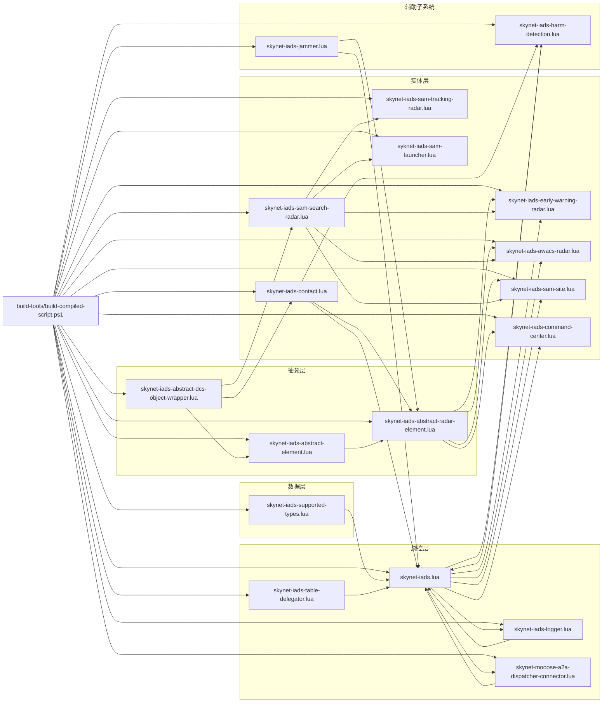
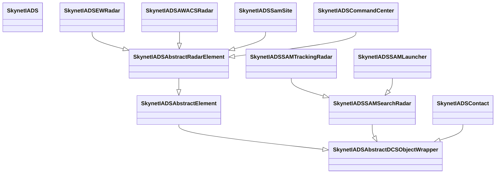

# Skynet-IADS 依赖关系可视化

## 文件级逻辑依赖

## 继承关系

## 如何读这张图

先抓 3 个重点：

1. `SkynetIADS` 是调度器，不是全部行为本体。
2. `SkynetIADSAbstractRadarElement` 是行为最重的基类。
3. `supported-types.lua` 不是行为逻辑，但它决定“哪些单位能进入系统”。

如果你要找“真正动刀的地方”，优先级通常是：

1. `skynet-iads.lua`
2. `skynet-iads-abstract-radar-element.lua`
3. `skynet-iads-sam-site.lua`
4. `skynet-iads-harm-detection.lua`
5. `skynet-iads-supported-types.lua`
