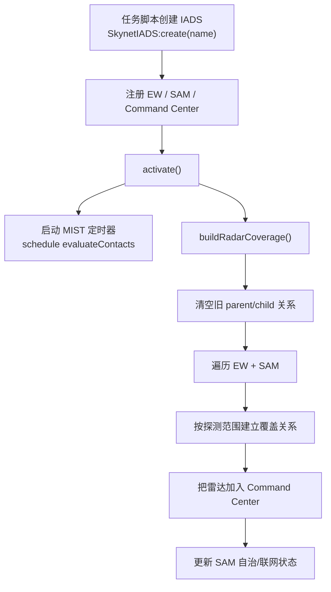
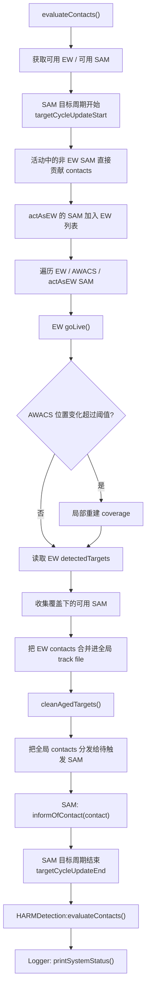
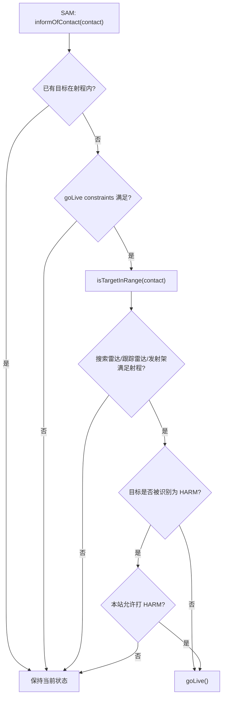
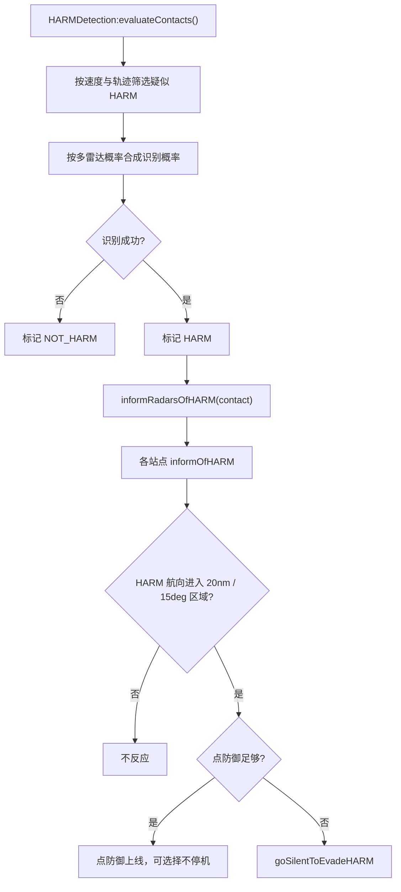

# Skynet-IADS 运行流程图

## 启动流程

## 主循环

## SAM 上线决策

## HARM 防御流程

## 阅读建议

如果你只想理解最小闭环，可以顺着这条链读：

1. `SkynetIADS.activate`
2. `SkynetIADS.evaluateContacts`
3. `SkynetIADSSamSite:informOfContact`
4. `SkynetIADSAbstractRadarElement:isTargetInRange`
5. `SkynetIADSAbstractRadarElement:goLive / goDark`

如果你想理解“为什么联网被破坏后站点会变化”，再补这条链：

1. `SkynetIADS:buildRadarCoverage`
2. `SkynetIADS:buildRadarAssociation`
3. `SkynetIADSAbstractRadarElement:setToCorrectAutonomousState`

如果你想理解“为什么会躲 HARM”，再补：

1. `SkynetIADSHARMDetection:evaluateContacts`
2. `SkynetIADSAbstractRadarElement:informOfHARM`
